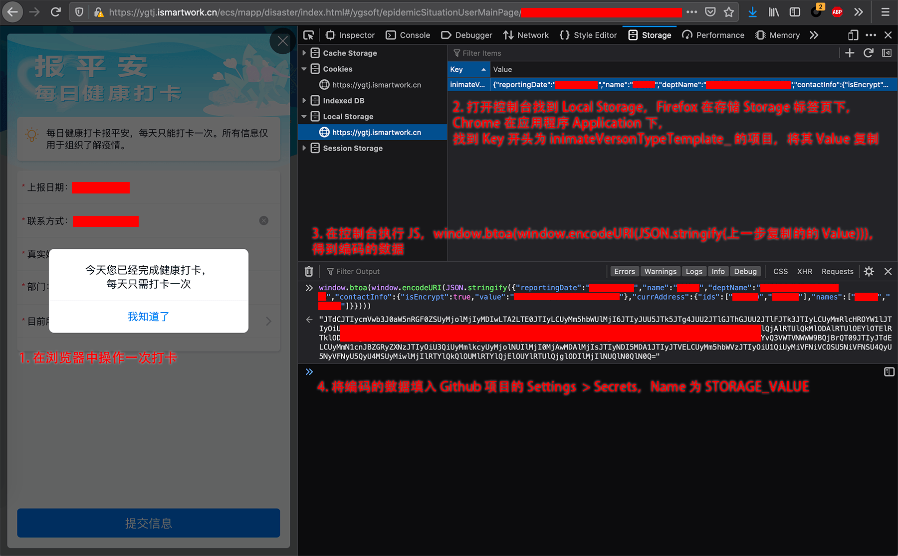
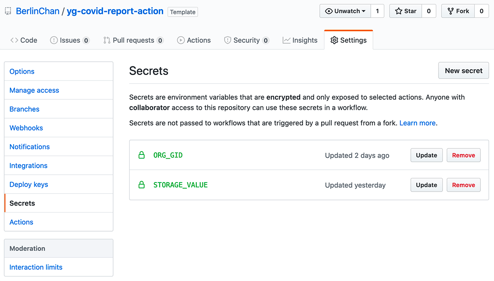
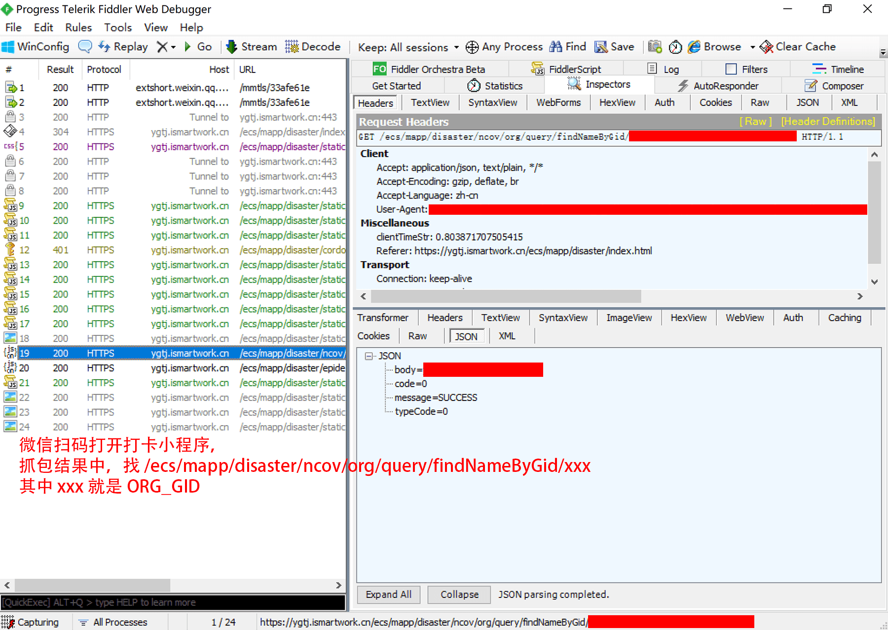

# yg-covid-report-action

使用 GitHub Actions 自动填报远光健康打卡。

这个 Action 会自动在北京时间的每天 8:00 AM 进行填报。

## 使用方法

首先，点击上方绿色的 **Use this template**，使用这个模板创建你自己的 Repository；

然后，在你自己仓库的 Settings 的 Secrets 中设置以下项：

- `ORG_GID`: 组织 id
- `STORAGE_VALUE`: 上次打卡的浏览器 localStorage 编码数据

两个参数的获取分两种情况，分别说明如下。

### 第一种，你有网页打卡页面的 URL

网页版打卡 URL 类似 https://ygtj.ismartwork.cn/ecs/mapp/disaster/index.html#/ygsoft/epidemicSituationUserMainPage/xxx ，则 `xxx` 就是 `ORG_GID`。

在网页中操作一次打卡后，就会在浏览器 localStorage 中留下上次打卡数据，如下图操作，获取参数 `STORAGE_VALUE` 的值：



```javascript
  window.btoa(window.encodeURI(JSON.stringify(上一步复制的的 Value)))
```

粘贴 `STORAGE_VALUE` 值到仓库的 Settings > Secrets，**注意不要前后的引号**，设置好如下图：



### 第二种，只有微信小程序二维码

只有微信小程序，要先抓包获取 ORG_GID，然后在浏览器中访问 `https://ygtj.ismartwork.cn/ecs/mapp/disaster/index.html#/ygsoft/epidemicSituationUserMainPage/xxx`，最后的 `xxx` 替换成抓到的 ORG_GID，后续按第一种步骤处理。



安卓系统 7.0 以上版本，微信 7.0 以上版本，微信只信任它自己配置的证书列表，[无法抓包 https](https://testerhome.com/topics/17746)，推荐用 iOS 来操作抓包，参见[教程](https://blog.csdn.net/baoming_mm/article/details/102995141)，本处不再赘述。

## 检查结果

无需任何设置。如果运行失败，GitHub 会向你的邮箱发送一封邮件。

如果你更改了设置，想手动重新运行，可以点进上方的 Actions 栏，点击 Re-run Jobs 来重新运行。

## 高级设置

你可以在 `.github/workflows/main.yml` 中来设置每天运行的时间：

```yml
on:
  schedule:
    - cron: "0 0 * * *"
```

格式是标准的 cron 格式，第一个数字代表分钟，第二个数字代表小时。例如，`0 1 * * *` 表示在每天
格林尼治时间的 1:00 AM，也就是在北京时间的 9:00 AM 自动运行。

## 参考

- [听说安卓微信 7.0 不能抓 https?](https://testerhome.com/topics/17746)
- [运用 fiddler 工具深度配置证书抓苹果 IOS 微信小程序或 app 数据请求](https://blog.csdn.net/baoming_mm/article/details/102995141)
- [bupt-ncov-report-action ](https://github.com/imtsuki/bupt-ncov-report-action)
- [Dlpu-Auto-Sign-In](https://github.com/sslspace/Dlpu-Auto-Sign-In)
